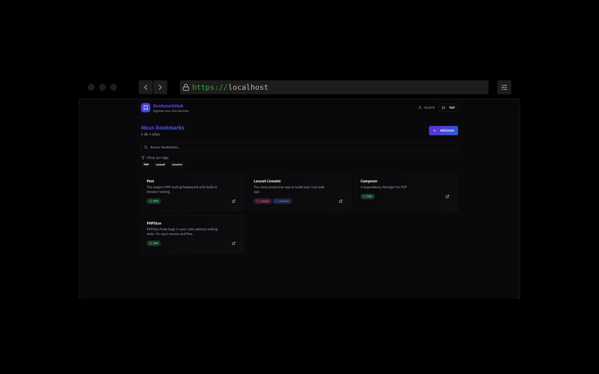
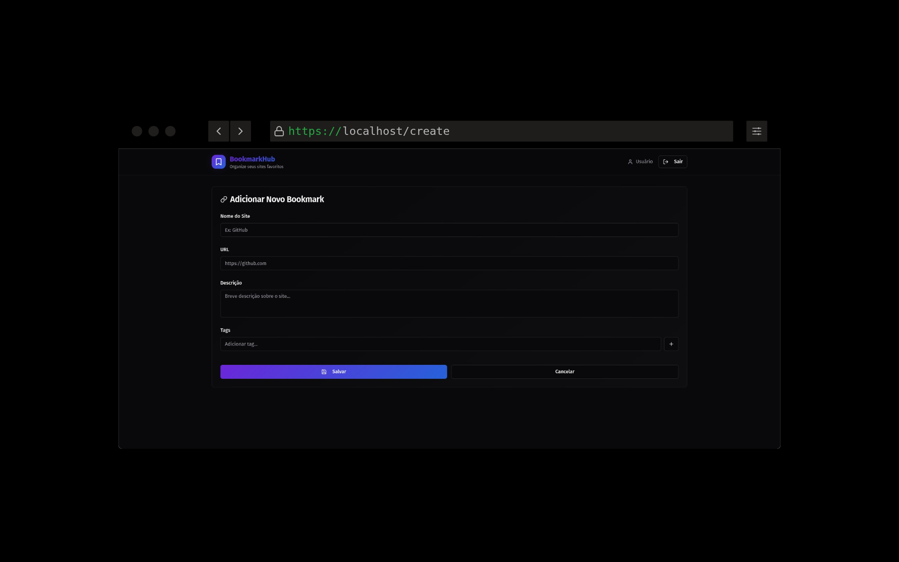
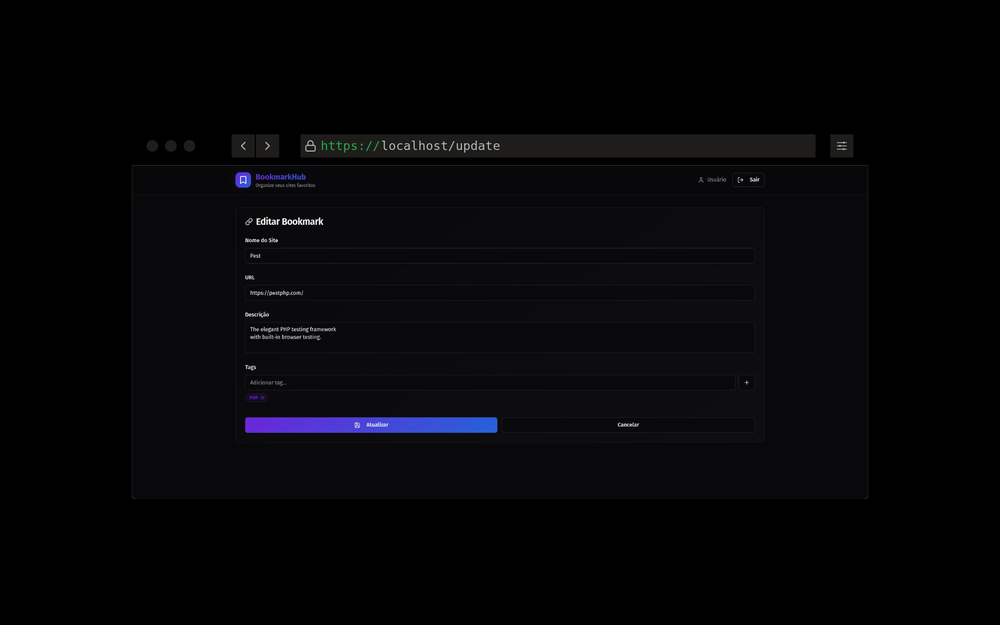

# BossaBox - VUTTR API Back-end

## Sobre o Projeto

A VUTTR (Very Useful Tools to Remember) é uma API simples para ajudar você a organizar e gerenciar suas ferramentas favoritas. Com ela, é possível cadastrar, listar, buscar por tags e remover ferramentas de forma rápida e prática.

A ideia é que você tenha um repositório centralizado onde cada ferramenta tem:

-   Título (nome da ferramenta)
-   Link (endereço oficial ou repositório)
-   Descrição (para que ela serve)
-   Tags (palavras-chave que facilitam a busca)

Tudo isso é armazenado em um banco de dados, garantindo que suas informações fiquem salvas e disponíveis sempre que precisar.

Este projeto foi desenvolvido como parte de um desafio da BossaBox. Você pode encontrar a descrição original do desafio [aqui](https://bossabox.notion.site/Back-end-0b2c45f1a00e4a849eefe3b1d57f23c6).

## Funcionalidades

-   **Autenticação de Usuário:** Acesso seguro à API com tokens.
-   **Gerenciamento de Ferramentas:**
    -   Adicionar novas ferramentas.
    -   Listar todas as ferramentas.
    -   Buscar ferramentas por tags.
    -   Excluir ferramentas.
-   **Gerenciamento de Usuários:**
    -   Criar novos usuários.
    -   Listar todos os usuários.
    -   Atualizar informações de usuários.
    -   Excluir usuários.

## Screenshots

**Consumo da API em um Front-end:**





## Como Executar o Projeto

1. **Clone o repositório:**

    ```bash
    git clone https://github.com/lucastakeshi/bossabox-vuttr-api.git
    cd bossabox-vuttr-api
    ```

2. **Instale as dependências:**

    ```bash
    composer install
    ```

3. **Configure o ambiente:**

    - Copie o arquivo `.env.example` para `.env`.
    - Configure as variáveis de ambiente, especialmente a conexão com o banco de dados.

    ```bash
    cp .env.example .env
    php artisan key:generate
    ```

4. **Execute as migrações do banco de dados:**

    ```bash
    php artisan migrate
    ```

5. **(Opcional) Popule o banco de dados com dados de teste:**

    ```bash
    php artisan db:seed
    ```

6. **Inicie o servidor:**
    ```bash
    php artisan serve
    ```

## Documentação da API

A documentação completa da API, com todos os endpoints, exemplos de requisições e respostas, está disponível e foi gerada com [Scramble](https://scramble.dedoc.co/).

Você pode acessá-la em: [http://localhost:8000/docs/api](http://localhost:8000/docs/api)
